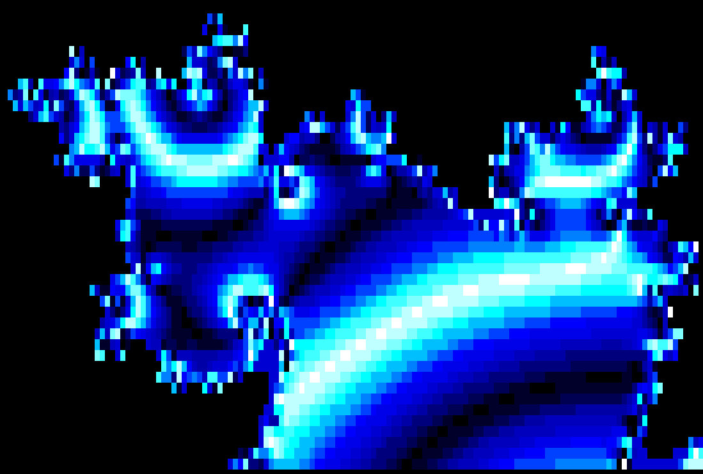
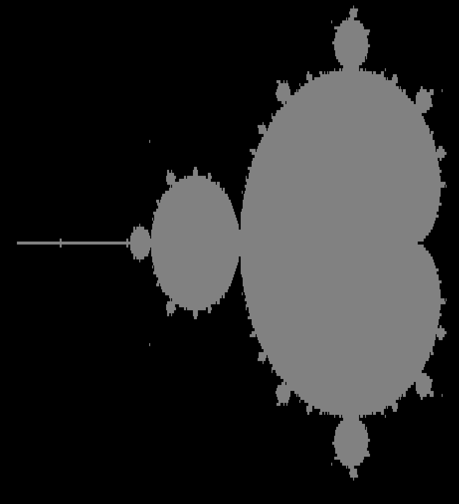

# Mandelbrot in the terminal 






### Building

```
cargo build --release
```

### Running

```
./target/release/mandelbrot
```

###

You will see a menu on the top left
   
```
? - Open help message
Arrows- Move Slower
wasd  - Move
WASD  - Move Faster
+-    - Zoom
()    - Depth 7
1     - Color mode
2     - Outline mode
q     - Quit
```

## Self-Promotion

I make video games

[Twitter](http://twitter.com/c64cosmin)

[YouTube](https://www.youtube.com/@c64cosmin)

You can play some free games here\
No download, directly in browser\
Hope you get a high score in the leader board :D

[HomePage](https://stupidrat.com)

## License

Copyright (c) Cosmin MUNTEANU.
